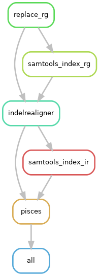

# Somatic Amplicon Pipeline

A [snakemake](https://snakemake.readthedocs.io) pipeline for calling variants from amplicon data using [Pisces](https://github.com/Illumina/Pisces).

### What it does ###



The pipeline first replaces the read group header using picard tools for compatibility with GATK3 IndelRealigner. Indel realignment is then performed and the pisces variant caller run. For more information see:

- [Samtools](https://www.htslib.org/)
- [Picard](https://broadinstitute.github.io/picard/)
- [GATK3 indel realignment](https://github.com/broadinstitute/gatk-docs/blob/master/gatk3-tutorials/%28howto%29_Perform_local_realignment_around_indels.md)
- [Pisces](https://github.com/Illumina/Pisces)

### Installation ###

The only prerequisite is [snakemake](https://snakemake.readthedocs.io/en/stable/getting_started/installation.html). To install snakemake, you will need to install a Conda-based Python3 distribution. For this, [Mambaforge](https://github.com/conda-forge/miniforge#mambaforge) is recommended. Once mamba is installed, snakemake can be installed like so:

```
mamba create -c conda-forge -c bioconda -n snakemake snakemake
```

Now activate the snakemake environment (you'll have to do this every time you want to run the pipeline):

```
conda activate snakemake
```

Now clone the repository:

```
git clone https://github.com/WEHIGenomicsRnD/somatic-amplicon-pipe.git
cd somatic-amplicon-pipe
```
### Configuration ###

The configuration file is found under `config/config.yaml`. Make sure to set these options carefully. The main variables to set would be a genome fasta reference and an intervals (bed file) containing your target region.

### Running ###

Place your *aligned bam files* (or symlink them) in a directory called 'mapped' in the pipeline root directory. Check that the pipeline has picked these up using:

```
snakemake --cores 1 --dry-run
```

You should see a list of steps to be processed on the target bam files.

If you want to submit your jobs to the cluster using SLURM (recommended), use the following to run the pipeline:

```
snakemake --use-conda --conda-frontend mamba --profile slurm --jobs 8 --cores 24
```

To run locally omit the `--profile slurm` part.

### NOTE about GATK3

You will notice that GATK3 IndelRealigner will fail on first run. Unfortunately, this is due to licensing restrictions. First, download the GATK3 jar file ([this link](https://console.cloud.google.com/storage/browser/gatk-software/package-archive/gatk;tab=objects?prefix=&forceOnObjectsSortingFiltering=false) should work; tested with v3.8.0). Now check the error log to see the conda environment (it should look something like `<working-directory>/.snakemake/conda/<id>`. Copy the path and activate the environment like so:

```
conda activate <working-directory>/.snakemake/conda/<id>
gatk3-register <path-to-GATK-jar-file>
conda deactivate
```

You can now run the rerun the pipeline. Unfortunately, you'll have to activate the environment and reregister gatk3 for every new run from a clean directory.

### Output ###

The pipeline will generate all results under a `results` directory, including bam realignments and variant calls in VCF format.
